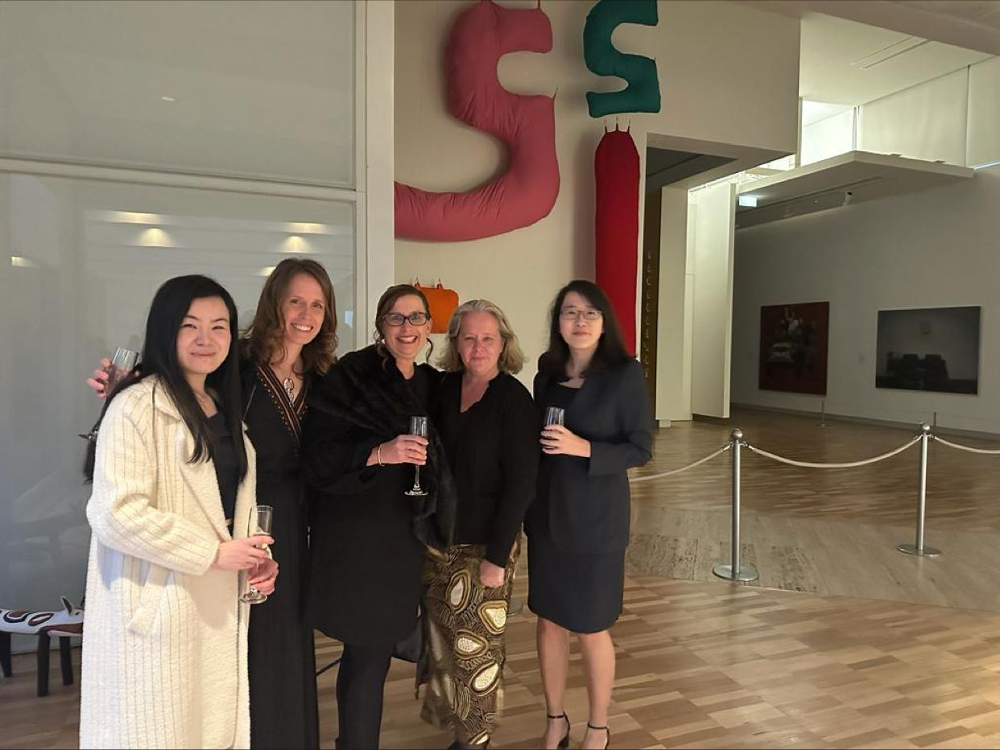
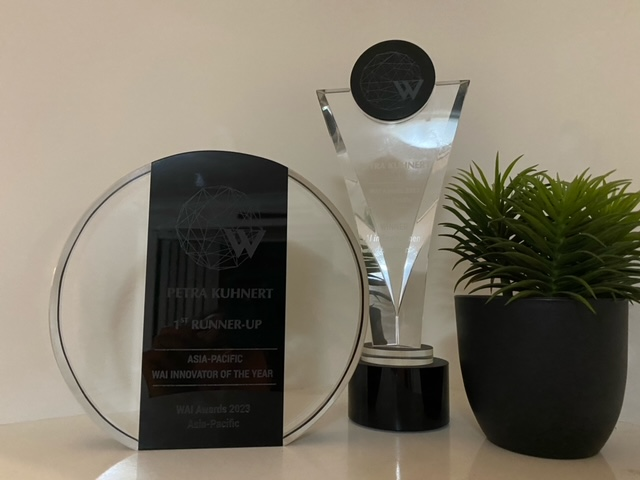

```{r setup, include=FALSE}
knitr::opts_chunk$set(echo = FALSE)
```

The Asia Pacific Women in AI (WAI) Awards are prestigious awards recognising women's achievements in AI development across a broad range of categories.  I was a [finalist in the 2023 WAI Awards](https://www.itnews.com.au/news/2023-women-in-ai-awards-finalists-revealed-596234) for the Environment and Biodiversity category based on my work in the Great Barrier Reef.  

The awards were held at the New South Wales Art Gallery and I was grateful to attend with my amazing CSIRO colleages, Xun Li, Jessica Ford, Cathy Robinson and Qinghua Lu.

```{r, fig.align='center', out.width='80%', echo = FALSE}

```

I won my category and also was first runner up for Innovator of the year.  It was such an amazing experience to come up on stage and receive both awards with my family watching from afar.

The awards gave me many opportunites to talk about my work and the experience. Acuity wrote a great article about how [women are shaping the future of AI](https://www.acuitymag.com/technology/how-are-women-shaping-the-future-of-ai). Digital Nation also interviewed me about my journey and wrote an article about how [AI is changing the ways of working](https://www.itnews.com.au/video/how-ai-has-transformed-ways-of-working-598649).

My awards now sit in my living room as a reminder of the achievement and the amazing work women in the asia pacific region are doing every day.

```{r, fig.align='center', out.width='80%', echo = FALSE}

```

Here is a clip put together by Digital Nation about the [WAI awards night.](https://www.linkedin.com/posts/athina-mallis-2291a1b9_in-this-weeks-digital-nation-australia-mini-activity-7091927028358156288-2QpS?utm_source=share&utm_medium=member_desktop)


